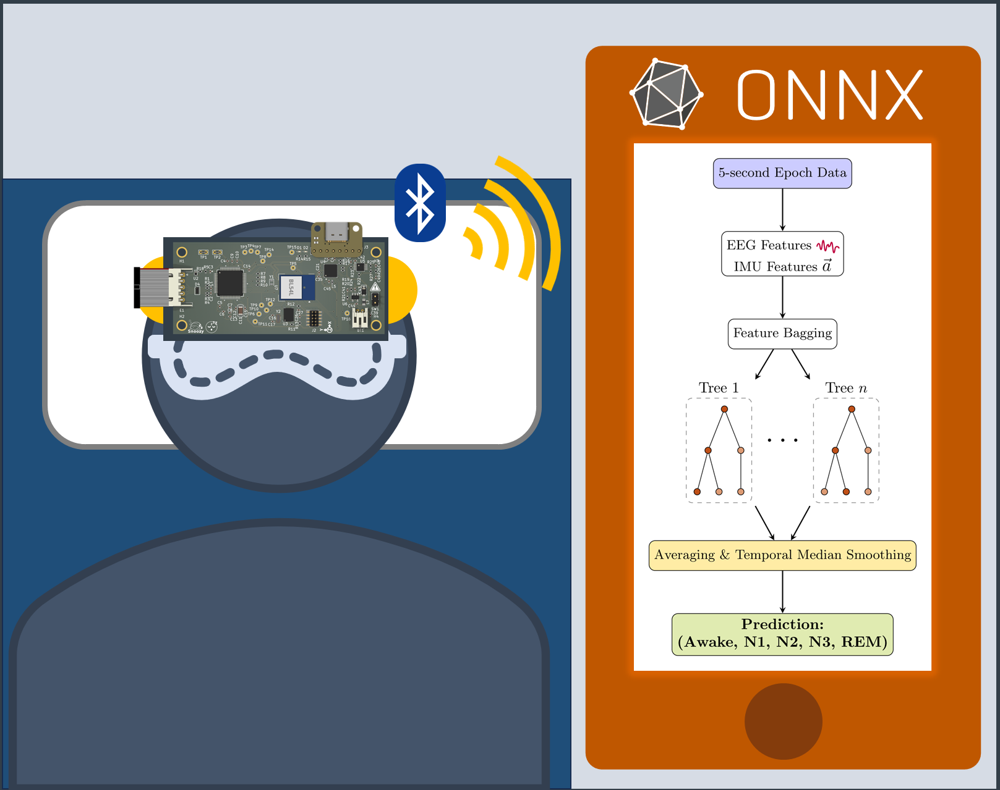

# UT Austin ECE Senior Design Project: Sleep Monitoring Headband

## Description

This repository contains work on our sleep state tracker wearable headband for ECE Senior Design at UT Austin. Members are Aidan Aalund, Justin Banh, Alex Ho, and Kien Ton. Mentored by Dr. Edison Thomaz. The wearable is powered by a Nordic nRF54L15 module and uses an ADS1299 biosensing amplifier from Texas Instruments for the analog front end. Bluetooth low energy transmits EEG and motion features collected by the board to a mobile app, which runs a random forest model to identify the user's current sleep stage. The app shows trends over time, ratings of sleep quality, and gives tips for improvements.

To view the full PCB layout online, [go to KiCanvas!](https://kicanvas.org/?repo=https%3A%2F%2Fgithub.com%2Faidanaalund%2Fsleep-wearable%2Ftree%2Fmain%2Fwearable%2Fhw%2Fwearable)

## Repository Structure (WIP)

### Wearable device files (`./wearable`)

#### Hardware Files (`./wearable/hw`)

#### Software Files (`./wearable/sw`)

### Companion application files (`./reactNative`)

### Machine learning files (`./ml`)

#### Sleep Stage Classifier (`./ml/sleep`)

#### Meditation Classifier (`./ml/meditation`)

### Other documentation (`./documents`)

## Known Errata

- SWCLK and SWDIO labels are connected to the SWD header incorrectly in the schematic and layout
