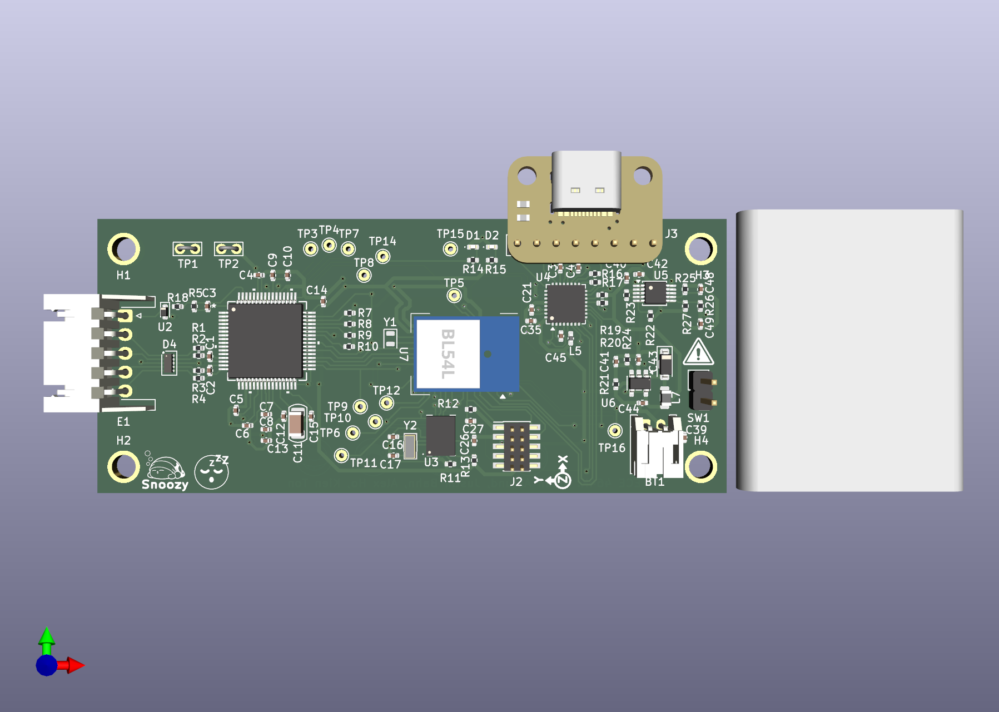

# ECE Senior Design Project: Sleep Wearable

## Description

Work on our sleep state tracker wearable headband for ECE Senior Design at UT Austin. Members are Aidan Aalund, Justin Banh, Alex Ho, and Kien Ton. Mentored by Dr. Edison Thomaz. The wearable is powered by a Nordic nRF54L15 module and uses an ADS1299 biosensing amplifier from Texas Instruments for the analog front end. Bluetooth low energy transmits EEG and motion features collected by the board to a mobile app, which runs a random forest model to identify the user's current sleep stage. The app shows trends over time, ratings of sleep quality, and gives tips for improvements.

## Repository Structure (TODO)
